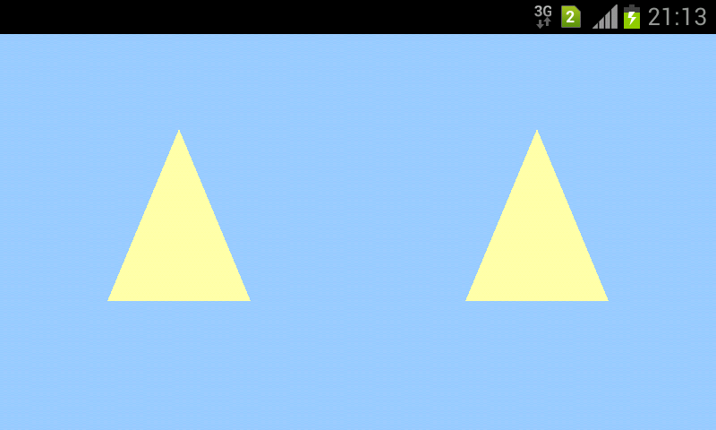

# AndroidOpenGLESVRViewTriangleApp

Android application created in Visual Studio using "native-activity" template.
The language of this project is C++ with OpenGL ES API
For now it just shows "hello triangle" example on two viewports as on the image attached. 
The goal is to draw a 3d model loaded from .obj

  

In order to run this sample "native-activity" template with Android NDK installed on Visual Studio are required.
